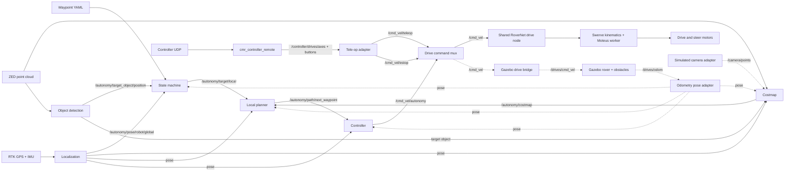

# Autonomy architecture

This map describes the current `autonomy_fall2026` data path. Solid edges are
shared runtime behavior; dashed edges are Gazebo adapters used only at system
boundaries. Arm packages are intentionally outside this document.

## Convergence boundary

Tele-op and autonomy differ only before the command mux. Both produce a
`cmr_msgs/DriveCommand`; launch mode or `/cmd_vel/source` selects one source.
The mux enforces input timeout and estop, then publishes only `/cmd_vel`.
RoverNet owns the shared swerve geometry, Moteus transport, and watchdog.
Gazebo replaces that final hardware backend, not perception or planning logic.

## Node ownership

| Stage | Main implementation | Inputs | Outputs |
| --- | --- | --- | --- |
| Mission | `state_machine.py`, `state_machine_core.py` | waypoint YAML, pose, object target | global and local targets |
| Localization | `new_kalman.py` | RTK GPS, IMU | global rover pose |
| Detection | `object_detection.py` | camera image/depth | target object position |
| Costmap | `costmap.py`, `costmap_core.py` | point cloud, pose, movement | obstacle cost cells |
| Local planning | `local_planner.py`, `planner_core.py` | local target, pose, costmap | next waypoint |
| Control | `controller.py`, `drive_command.py` | next waypoint, pose, stop | normalized chassis command |
| Arbitration | `command_mux.py`, `command_mux_core.py` | named drive commands, estop | selected `/cmd_vel` |
| Manual input | `connect.py`, `usama_control_testing.py` | UDP controller data | `/cmd_vel/teleop` |
| Messages | `cmr_msgs` | shared schemas | ROS interfaces |

## Launch behavior

- `./run auto` starts the real RoverNet drive node, localization, perception,
  local planner, state machine, and controller. The controller retains its
  30-second safety delay.
- `./run sim` starts simulated-input autonomy nodes, but does not launch Gazebo,
  spawn a rover, adapt odometry, synthesize camera data, or add a drive backend.
- The state machine publishes its selected target directly to the local planner.
- Rerun visualization defaults on in the real local planner and requires its
  configured remote endpoint unless disabled.

## Gazebo feedback-loop validation

A headless three-obstacle test exercised the real costmap, local planner,
controller, and selected `/cmd_vel` interface. Only odometry, camera,
goal, and drive-backend adapters were simulation-specific.

- Goal: `(6.0, 0.0)`; reached the 0.3 m tolerance at 98.4 seconds.
- Final pose: `(6.154, 0.048)`; final goal error: 0.161 m.
- Path length: 7.462 m; two obstacle-driven replans occurred.
- Minimum obstacle center clearance: 1.255 m.
- ROS bag: 5,748 messages over 130.4 seconds with no runtime errors.
- Every distinct Gazebo command matched the selected `/cmd_vel`, and both
  streams ended with a zero command.

## Remaining gaps

- Convert the isolated Gazebo harness into a repeatable committed launch test.
- Remove the duplicated global/local target path and launch one canonical route.
- Move planner thresholds, grid sizes, and controller gains into ROS parameters.
- Add sensor-dropout, no-path, manual-override, and watchdog system tests.
