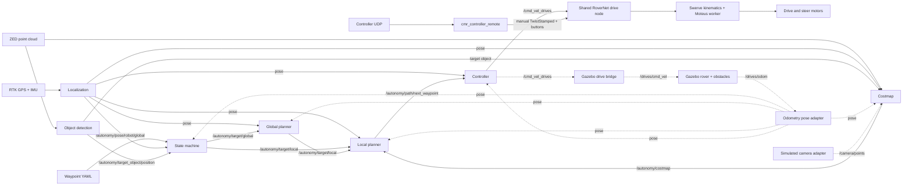

# Autonomy architecture

This map describes the current `autonomy-fall2026` data path. Solid edges are
shared runtime behavior; dashed edges are Gazebo adapters used only at system
boundaries. Arm packages are intentionally outside this document.

## Convergence boundary

Tele-op and autonomy differ only before the shared drive node. Tele-op produces
manual controller topics; autonomy produces normalized `Twist` commands on
`/cmd_vel_drives`. The RoverNet node arbitrates those inputs and owns the same
swerve geometry, Moteus transport, watchdog, and motor command path for both.
Gazebo replaces that final hardware backend, not perception or planning logic.
