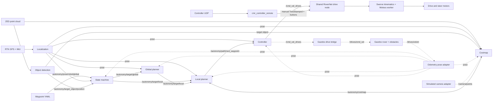

# Autonomy architecture

This map describes the current `autonomy-fall2026` data path. Solid edges are
shared runtime behavior; dashed edges are Gazebo adapters used only at system
boundaries. Arm packages are intentionally outside this document.

## Convergence boundary

Tele-op and autonomy differ only before the shared drive node. Tele-op produces
manual controller topics; autonomy produces normalized `Twist` commands on
`/cmd_vel_drives`. The RoverNet node arbitrates those inputs and owns the same
swerve geometry, Moteus transport, watchdog, and motor command path for both.
Gazebo replaces that final hardware backend, not perception or planning logic.

## Node ownership

| Stage | Main implementation | Inputs | Outputs |
| --- | --- | --- | --- |
| Mission | `state_machine.py`, `state_machine_core.py` | waypoint YAML, pose, object target | global and local targets |
| Localization | `new_kalman.py` | RTK GPS, IMU | global rover pose |
| Detection | `object_detection.py` | camera image/depth | target object position |
| Costmap | `costmap.py`, `costmap_core.py` | point cloud, pose, movement | obstacle cost cells |
| Global planning | `global_planner.py` | global target, pose | local target |
| Local planning | `local_planner.py`, `planner_core.py` | local target, pose, costmap | next waypoint |
| Control | `controller.py`, `drive_command.py` | next waypoint, pose, stop | normalized chassis command |
| Arbitration | `usama_control_testing.py` | autonomy and manual commands | Moteus drive/steer tasks |
| Manual input | `cmr_controller_remote/connect.py` | UDP controller packets | manual drive topics |
| Messages | `cmr_msgs` | shared schemas | ROS interfaces |

## Launch behavior

- `./run auto` starts the real RoverNet drive node, localization, perception,
  local planner, state machine, and controller. The controller retains its
  30-second safety delay.
- `./run sim` starts simulated-input autonomy nodes, but does not launch Gazebo,
  spawn a rover, adapt odometry, synthesize camera data, or add a drive backend.
- The real launch omits `global_planner`; the state machine currently publishes
  the same selected target to both global and local target topics.
- Rerun visualization defaults on in the real local planner and requires its
  configured remote endpoint unless disabled.

## Gazebo feedback-loop validation

A headless three-obstacle test exercised the real costmap, global planner, local
planner, controller, and `/cmd_vel_drives` interface. Only odometry, camera,
goal, and drive-backend adapters were simulation-specific.

- Goal: `(6.0, 0.0)`; reached the 0.3 m tolerance at 98.4 seconds.
- Final pose: `(6.154, 0.048)`; final goal error: 0.161 m.
- Path length: 7.462 m; two obstacle-driven replans occurred.
- Minimum obstacle center clearance: 1.255 m.
- ROS bag: 5,748 messages over 130.4 seconds with no runtime errors.
- Every distinct `/drives/cmd_vel` value matched a controller value from
  `/cmd_vel_drives`, and both streams ended with a zero command.

## Remaining gaps

- Convert the isolated Gazebo harness into a repeatable committed launch test.
- Remove the duplicated global/local target path and launch one canonical route.
- Move planner thresholds, grid sizes, and controller gains into ROS parameters.
- Add sensor-dropout, no-path, manual-override, and watchdog system tests.
