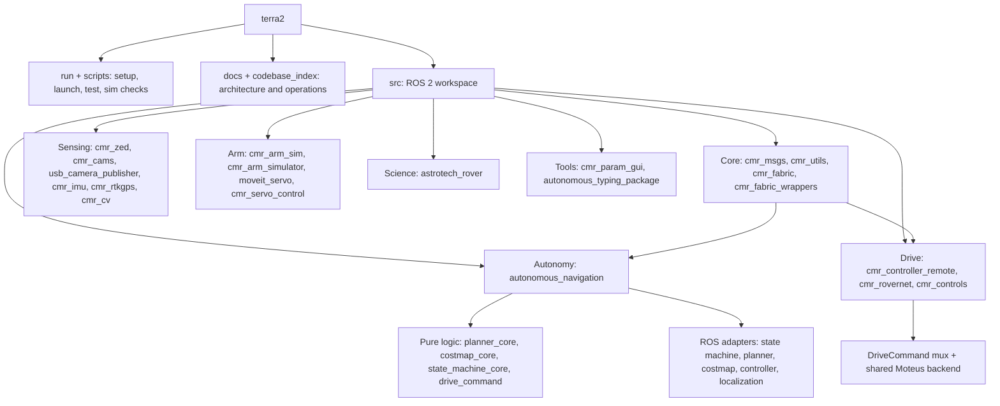

# Terra2 codebase map

Source-verified on `autonomy_fall2026`. The workspace contains 20 ROS 2
packages plus the generated `cmr_arm_simulator_moveit_config` package.

| Area | Primary ownership |
| --- | --- |
| Interfaces | `src/cmr_msgs/msg`, `src/cmr_msgs/srv` |
| Runtime orchestration | `cmr_fabric`, TOML configs, package `launch/` folders |
| Autonomy decisions | `src/autonomous_navigation/autonomous_navigation` |
| Tele-op ingress | `src/cmr_controller_remote`, controller-side `zenchang_controller` |
| Drive actuation | `src/cmr_rovernet`; `cmr_controls` retains compatibility/tools |
| Perception/localization | `cmr_zed`, `cmr_cams`, `cmr_imu`, `cmr_rtkgps` |
| Arm stack | `cmr_arm_sim*`, `moveit_servo`, `cmr_servo_control` |
| Science stack | `src/astrotech_rover` |
| Tests | package `test/` folders and `scripts/test_autonomy.sh` |

## Main entry points

- `./run teleop`: controller receiver, mux in tele-op mode, shared drive backend.
- `./run auto`: sensors, autonomy pipeline, mux in autonomy mode, shared backend.
- `./run sim`: simulated-input autonomy nodes; Gazebo remains an external harness.
- `./run test`: focused autonomy and drive safety tests.

See [ROS structure](ros-structure.md) for nodes/topics and
[autonomy architecture](autonomy-architecture.md) for planner internals.
