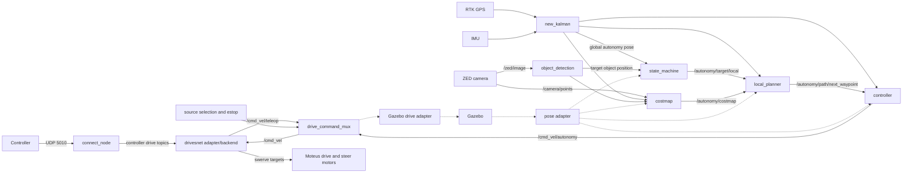

# ROS structure

This graph shows the canonical runtime path. Labels are ROS topics; boxes are
nodes or external systems. Dashed edges are simulation boundary adapters.

## Drive contract

| Topic | Type | Owner |
| --- | --- | --- |
| `/cmd_vel/teleop` | `cmr_msgs/DriveCommand` | manual adapter |
| `/cmd_vel/autonomy` | `cmr_msgs/DriveCommand` | autonomy controller |
| `/cmd_vel/source` | `std_msgs/String` | operator/launch mode |
| `/cmd_vel/estop` | `std_msgs/Bool` | safety inputs |
| `/cmd_vel` | `cmr_msgs/DriveCommand` | mux only; backend input |

`DriveCommand` carries normalized `vx`, `vy`, and `omega`, plus signed
`speed_rps`. The mux invalidates buffered commands on source changes, enforces a
0.5-second timeout, latches estop, and publishes zeros when motion is unsafe.

## Other domains

- Arm: controller Joy -> MoveIt Servo -> joint trajectory -> RoverNet arm backend.
- Cameras: USB/ZED nodes publish raw, rectified, stitched, and bird's-eye images.
- Science: `astrotech_node` owns auger, Raman, environment, and mixing interfaces.
- Fabric: lifecycle manager and fault handler supervise TOML-composed nodes.

Legacy arm IK utilities also use `/cmd_vel` as `Twist`; remap them before
co-launching because the canonical drive topic uses `DriveCommand`.
